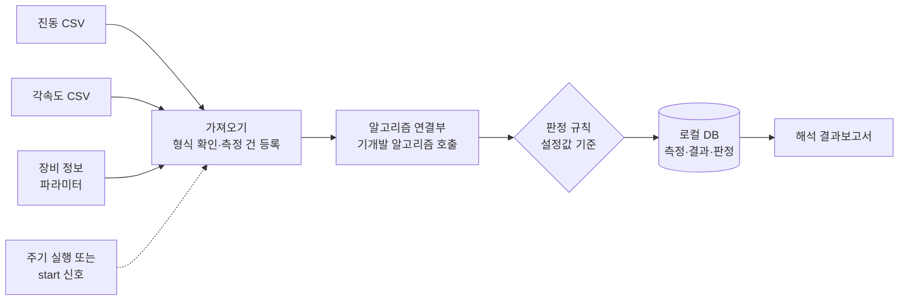

# 진동·각속도 데이터 분석 결과 DB화 Agent — 프로젝트 기획서

| 항목 | 내용 |
|---|---|
| 리포 | data09-14 |
| 제출자 | 정화용 |
| 직무·소속 | 진동 해석 담당 |
| 과정 | 현장 데이터 디지털화 전문가과정 1차수 |
| 작성일 | 2026-09-28 |
| 문서 상태 | 초안 v0.1 — 수강생 제출 자료 기반 |

---

## 1. 추진 배경과 현안

- 진동 센서와 각속도 센서로 데이터를 취득하고 있습니다.
- 이 데이터에 이미 개발된 알고리즘을 적용해 결과 값을 도출하고, 그 값을 해석해 **정상 / 주의 / 고장**으로 판정합니다.
- 도출 값과 판정 결과를 정리해 **DB로 쌓는 체계**가 필요합니다.
- 모든 산출물은 **폐쇄망**에서 동작해야 합니다.

현재는 센서 데이터를 받을 때마다 알고리즘을 수동으로 실행하고, 결과와 판정을 개별 파일이나 문서로 정리하는 것으로 보입니다(가정). 이 경우 결과가 흩어져 장비별·기간별 추이를 보기 어렵고, 판정 기준이 담당자마다 달라질 수 있습니다(가정).

## 2. 목표

### 2.1 최종 목표

- 진동·각속도 CSV가 들어오면 **주기적으로 또는 실행(start) 신호가 있을 때** 기존 알고리즘을 자동 실행하고, 결과 값과 판정(정상/주의/고장)을 **DB에 저장**하는 프로그램
- DB에 쌓인 결과로 **해석 결과보고서**를 자동으로 만드는 프로그램
- 두 프로그램 모두 **인터넷 연결 없이 폐쇄망 안에서만** 동작

### 2.2 1차 개발 목표

- 수강생의 알고리즘을 받기 전에도 만들 수 있는 **틀**을 먼저 만듭니다. CSV 가져오기, DB 구조, 알고리즘을 끼워 넣는 연결부(임시 계산으로 대체), 판정 기준 설정, 보고서 생성까지 한 흐름으로 돌아가게 합니다.
- 실제 알고리즘은 2단계에서 연결부에 끼워 넣습니다. 알고리즘 코드를 도구 안에 섞지 않고 분리해 두므로, 알고리즘이 바뀌어도 나머지는 그대로 씁니다.

## 3. 보유 데이터

| 데이터 | 형태 | 규모·주기 | 비고(민감도 등) |
|---|---|---|---|
| 진동 데이터 | CSV | 샘플링 주파수·측정 시간·파일 크기 미상 | 폐쇄망 반출 불가 데이터로 가정. 열 구성 미상(시각, 축별 가속도 등이 있을 것으로 가정) |
| 각속도 데이터 | CSV | 샘플링 주파수·측정 시간·파일 크기 미상 | 진동 데이터와 같은 시각 기준으로 맞춰 쓰는지 미상(가정 — 확인 필요) |
| 장비 정보 | 파라미터(형태 미상) | 장비 수 미상 | 알고리즘 입력값으로 쓰이는 것으로 가정(예: 회전수, 형식, 센서 위치 등 — 가정) |
| 기개발 알고리즘 | 형태 미상(언어·실행 방식 미상) | — | 수강생 고유 자산. 이 기획에서는 내부를 다루지 않고 입력·출력만 정의합니다 |

제출 원문에 첨부 파일은 없습니다. CSV 샘플과 알고리즘의 입력·출력 형식이 있어야 연결을 확정할 수 있습니다(10장).

## 4. 해결 방안 개요

| 단계 | 내용 |
|---|---|
| 수집 | 지정 폴더에 들어온 진동·각속도 CSV와 장비 정보 |
| 정리 | CSV 형식 확인(열 이름·단위·결측), 측정 건 단위로 DB에 등록, 이미 처리한 파일은 건너뜀 |
| 분석 | 연결부를 통해 기개발 알고리즘 실행 → 결과 값 저장 → 설정된 임계값으로 정상/주의/고장 판정 |
| AI | 폐쇄망 요건상 외부 AI는 쓰지 않습니다. 보고서 문장은 판정 결과로 채우는 정해진 문구(템플릿)로 만듭니다 |
| 산출물 | 결과 DB, 해석 결과보고서(HTML·엑셀, 인쇄 가능) |

## 5. 주요 기능

| 기능 | 설명 | 우선순위 |
|---|---|---|
| CSV 가져오기 | 진동·각속도 CSV를 읽어 형식을 확인하고 측정 건으로 등록. 열 이름이 다를 수 있어 열 매핑 설정 제공 | MVP |
| 장비 정보 관리 | 장비별 파라미터를 등록·수정하고 측정 건과 연결 | MVP |
| 결과 DB | 장비, 측정 건, 알고리즘 결과 값, 판정, 실행 이력을 표로 저장(로컬 파일형 DB) | MVP |
| 알고리즘 연결부 | 「입력(측정 데이터 + 장비 정보) → 출력(결과 값 목록)」 약속만 정해 두고, 실제 알고리즘은 교체형으로 끼워 넣음. 1단계는 임시 계산(예: RMS·최대값 같은 기본 통계)으로 대체 | MVP |
| 판정 규칙 설정 | 결과 값별로 주의·고장 임계값을 설정 파일에서 지정. 코드 수정 없이 기준 변경 | MVP |
| 실행 방식 | 수동 실행(start), 폴더 감시 또는 운영체제 작업 예약으로 주기 실행 | MVP(수동) / 확장(주기) |
| 해석 결과보고서 | 기간·장비를 골라 판정 요약과 결과 값 표를 담은 보고서 생성 | MVP |
| 실행 이력·오류 기록 | 처리한 파일, 사용한 알고리즘 버전·판정 기준, 실패 사유를 기록 | MVP |
| 추이 그래프 | 장비별 결과 값의 시간 추이와 임계선 표시 | 확장 |
| 장비별 기준 차등 | 장비 형식이나 위치에 따라 판정 임계값을 다르게 적용 | 확장 (가정 — 필요 여부 확인) |
| 판정 검토·수정 | 담당자가 자동 판정을 확인·수정하고 사유를 남김 | 확장 |

## 6. 기대 산출물

1. **초기 DB 구조** — 장비, 측정 건, 결과 값, 판정, 실행 이력 표와 설명서
2. **분석·저장 프로그램(폐쇄망)** — 수동 또는 주기 실행 시 기개발 알고리즘을 돌리고 결과·판정을 DB에 저장
3. **해석 결과보고서 생성 프로그램(폐쇄망)** — DB 결과로 보고서(HTML·엑셀) 생성
4. **판정 기준 설정 파일** — 결과 값별 주의·고장 임계값

## 7. 기술 구성

| 과정 도구 | 이 프로젝트에서 쓰는 곳 |
|---|---|
| DAY1 암묵지 자산화·전략기획 | 담당자가 결과 값을 보고 정상/주의/고장을 가르는 기준과 해석 문구를 규칙으로 꺼내 적기 |
| DAY2 코랩(Python)·바이브코딩 | CSV 처리, DB 저장, 판정, 보고서 로직 작성 — 이 프로젝트의 중심. 단, 실제 운영은 코랩이 아니라 폐쇄망 PC의 로컬 Python으로 합니다. 코랩은 가상 데이터로 로직을 연습할 때만 씁니다 |
| DAY3 멀티모달 비정형 정보화 | (필요 시) 장비 사양서에서 장비 파라미터 정리 |
| DAY4 RAG (Dify, NotebookLM) | 폐쇄망이라 적용하지 않습니다. 사내 로컬 AI가 허용될 때 과거 해석 사례 질의로 검토 (확장, 가정) |
| DAY5 Make 자동화 | 클라우드 서비스라 적용하지 않습니다. 같은 역할은 폴더 감시·운영체제 작업 예약으로 대신합니다 |
| 생성형 AI | 개발 단계의 코드 작성 보조에만 씁니다. 운영 중 프로그램은 AI를 호출하지 않습니다 |

**개발 형태(권장)**

- **로컬 Python 프로그램 + 파일형 DB(SQLite)** 로 만듭니다. 별도 DB 서버가 필요 없고 파일 하나로 옮기고 백업할 수 있어 폐쇄망에 맞습니다.
- 기개발 알고리즘이 Python이면 같은 프로그램 안에서 불러오고, 다른 언어나 실행 파일이면 **외부 프로그램으로 실행하고 결과 파일을 읽는 방식**으로 연결합니다(알고리즘 형태에 따라 결정 — 10장).
- 보고서는 **브라우저로 여는 HTML 파일과 엑셀**로 만듭니다. 외부 글꼴·스크립트 링크 없이 파일 하나에 모두 담아 폐쇄망에서도 그대로 열립니다.
- 폐쇄망에서는 라이브러리를 인터넷으로 설치할 수 없으므로, 필요한 Python 패키지를 **설치 파일째로 묶어 반입**하거나 기본 라이브러리만으로 동작하게 합니다. 폐쇄망 PC의 Python 설치 여부와 버전 확인이 필요합니다(10장).
- 클라우드 AI, 코랩, 외부 자동화 서비스는 운영 흐름에 넣지 않습니다.

## 8. 개발 단계

### 1단계 — 지금 바로 개발 가능한 부분

수강생의 알고리즘 없이도 **데이터가 들어와서 DB에 저장되고 보고서가 나오기까지의 틀**은 지금 만들 수 있습니다. 알고리즘 자리는 임시 계산으로 채워 두고, 나중에 그 자리만 바꿉니다.

- **CSV 가져오기** — 진동·각속도 CSV 읽기, 열 매핑 설정, 필수 열·결측·시각 순서 확인, 이미 처리한 파일 건너뛰기
- **DB 구조(SQLite)** — `장비`(장비 ID, 파라미터), `측정`(측정 ID, 장비, 측정 일시, 원본 파일 경로), `결과`(측정, 결과 항목 이름, 값, 단위), `판정`(측정, 판정 등급, 근거 항목, 적용 기준 버전), `실행 이력`(실행 시각, 처리 건수, 알고리즘 버전, 오류 내용)
- **교체형 알고리즘 연결부** — 입력(측정 데이터 + 장비 파라미터)과 출력(결과 항목 이름·값·단위 목록)만 정한 약속. 1단계에서는 RMS·최대값·첨도 같은 기본 통계를 내는 **임시 알고리즘**을 끼워 흐름을 확인합니다. 임시 값은 판정용이 아니라 시험용입니다
- **판정 규칙 설정** — 결과 항목별 주의·고장 임계값을 설정 파일(예: YAML 또는 엑셀 표)에 적고, 가장 나쁜 항목 기준으로 등급을 매깁니다. 임계값은 가상의 값으로 두고, 실제 값은 수강생이 채웁니다
- **실행** — 명령 한 번(start)으로 지정 폴더의 새 CSV를 일괄 처리
- **해석 결과보고서** — 기간·장비를 골라 판정 등급별 건수, 측정 건별 결과 값 표, 주의·고장 건 목록을 HTML·엑셀로 생성
- **시험용 가상 데이터** — 정상 신호와 일부러 진폭을 키운 신호를 만들어 판정이 등급별로 갈리는지, 같은 파일을 두 번 넣어도 중복 저장되지 않는지 확인합니다

### 2단계

- 실제 CSV 샘플로 가져오기 보정(열 이름, 단위, 샘플링 정보)
- **기개발 알고리즘을 연결부에 연결**하고 임시 알고리즘 제거
- 실제 판정 기준(임계값)과 해석 문구 반영
- 주기 실행(폴더 감시 또는 운영체제 작업 예약)
- 폐쇄망 PC에 설치·반입 절차 정리(설치 파일 묶음, 실행 방법 안내)

### 3단계

- 장비별 결과 값 추이 그래프와 임계선 표시
- 장비 형식·위치별 판정 기준 차등
- 담당자 판정 검토·수정 기능과 수정 이력
- 보고서 양식을 사내 양식에 맞춤(가정 — 기존 양식이 있을 경우)

## 9. 기대 효과

- **결과 축적과 추적** — 흩어져 있던 도출 값과 판정이 한 DB에 쌓여 장비별·기간별 이력을 바로 찾을 수 있습니다.
- **판정 기준 일관화** — 임계값이 설정 파일 하나로 관리되어 누가 실행해도 같은 기준으로 판정합니다. 기준을 바꾼 기록도 남습니다.
- **반복 작업 감소** — 데이터가 들어오면 알고리즘 실행·저장·판정이 자동으로 이어집니다.
- **보고서 작성 시간 단축** — DB 결과로 보고서가 바로 만들어집니다.
- **보안 요건 충족** — 데이터와 알고리즘이 폐쇄망 밖으로 나가지 않습니다.

제출 자료에는 정량 수치가 없어 이 문서도 수치를 적지 않습니다.

## 10. 확인 필요 사항

**샘플 데이터 (필수)**

1. 진동 CSV·각속도 CSV 샘플 각 1건 — 열 구성(시각, 축, 단위), 샘플링 주파수, 한 파일의 측정 시간과 크기. 실제 값이 어렵다면 열 구성만 같은 가짜 파일도 괜찮습니다
2. 진동·각속도 파일이 한 측정 건으로 짝지어지는 방식(파일 이름 규칙, 같은 시각 기준 여부)
3. 장비 정보(파라미터)의 형태 — 어떤 항목이 있고, 어떤 파일(엑셀·텍스트 등)로 관리하는지

**기개발 알고리즘**

4. 알고리즘의 언어와 실행 방식(Python 함수, MATLAB, 실행 파일 등)
5. 입력(어떤 데이터와 파라미터를 받는지)과 출력(결과 값 항목 이름·개수·단위)
6. 알고리즘 버전 관리 여부 — 결과에 어느 버전으로 계산했는지 남겨야 하는지

**판정 기준**

7. 정상/주의/고장을 가르는 기준 — 결과 값별 임계값인지, 여러 값을 조합하는지, 장비마다 다른지
8. 판정이 애매한 경우 담당자가 수정하는 절차가 있는지
9. 기존 해석 결과보고서 양식(있다면)과 꼭 들어가야 할 항목

**운영·환경**

10. 「주기적으로」와 「start」의 의미 — 정해진 시간마다 실행인지, 새 파일이 들어오면 실행인지, 사람이 버튼을 누르는지
11. 데이터가 들어오는 위치(공유 폴더, 계측 장비 PC 등)와 들어오는 빈도
12. 폐쇄망 PC 환경 — 운영체제, Python 설치 여부와 버전, 외부 파일(설치 패키지) 반입 절차
13. DB를 여러 사람이 함께 봐야 하는지, 담당자 한 명의 PC에서만 쓰는지(공유가 필요하면 파일형 DB 대신 사내 DB 서버 검토)

## 부록. 제출 원문 요약

| 출처 | 파일·게시물 | 내용 |
|---|---|---|
| 패들릿 게시물 1 (2026-09-28T07:44) | 「데이터 분석 Agent」 — `기획_원문.md` | 직무(진동 해석 담당), 현안(진동·각속도 센서 데이터로 기개발 알고리즘 결과 도출 및 정상/주의/고장 해석 결과를 정리해 DB화), 보유 데이터(진동 CSV, 각속도 CSV, 장비 정보 파라미터), 기대 산출물(초기 DB 구조, 알고리즘 연동 후 주기 또는 start 시 결과를 DB에 저장하는 프로그램, 결과보고서 도출 프로그램 — 모두 폐쇄망) |

첨부 파일은 제출되지 않았습니다(`attachments.json` 비어 있음).
